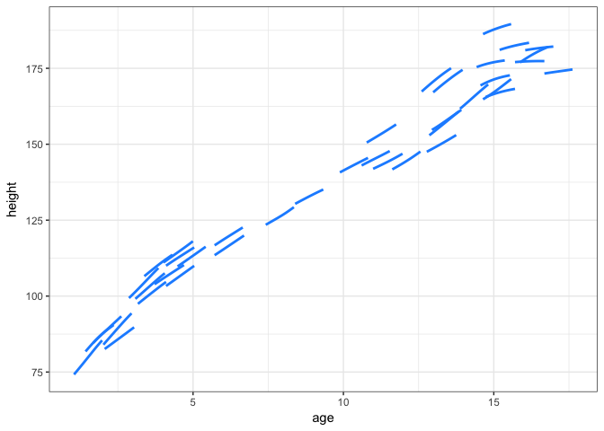
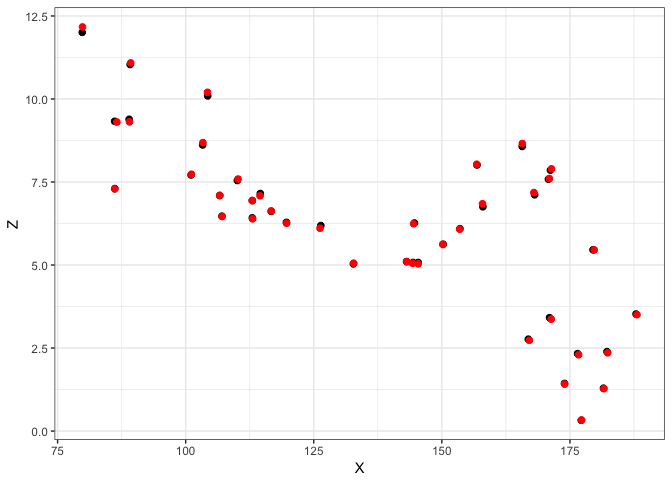

Using Functions in Snippet2XZ.R
================
Matt Dawson
10/28/2017

Introduction
------------

This is a simple tutorial for the function `Snippet2XZ` which summarizes snippet information to level and slope pairs \(X\) and \(Z\).

Load Sample Data
----------------

I've included some snippet data generated from the Berkeley Growth data. Let's look at the data.

``` r
library(tidyverse)

# Load the data and plot the dense snippets
load('snippetData.Rdata')
dense <- out$dense
sparse <- out$sparse
ggplot(dense, aes(x=age, y=height, group=id)) +
  geom_line(size=1, col='dodgerblue') +
  theme_bw()
```



Note that there are two separate snippet datasets here:

-   `dense`: densely measured snippets- many observations per snippet.
-   `sparse`: sparsely measured snippets- two observations per snippet.

To be clear, let's just take a look at the underlying data.

``` r
dense[dense$id == 'boy01', ]
```

    ##       id    age   height
    ## 1  boy01 4.1025 110.0085
    ## 2  boy01 4.1450 110.3020
    ## 3  boy01 4.1875 110.5905
    ## 4  boy01 4.2300 110.8750
    ## 5  boy01 4.2725 111.1561
    ## 6  boy01 4.3150 111.4347
    ## 7  boy01 4.3575 111.7112
    ## 8  boy01 4.4000 111.9860
    ## 9  boy01 4.4425 112.2595
    ## 10 boy01 4.4850 112.5319
    ## 11 boy01 4.5275 112.8034
    ## 12 boy01 4.5700 113.0741
    ## 13 boy01 4.6125 113.3441
    ## 14 boy01 4.6550 113.6135
    ## 15 boy01 4.6975 113.8823
    ## 16 boy01 4.7400 114.1506
    ## 17 boy01 4.7825 114.4182
    ## 18 boy01 4.8250 114.6853
    ## 19 boy01 4.8675 114.9518
    ## 20 boy01 4.9100 115.2176
    ## 21 boy01 4.9525 115.4827
    ## 22 boy01 4.9950 115.7474
    ## 23 boy01 5.0375 116.0117

``` r
sparse[sparse$id == 'boy01', ]
```

    ##      id    age   height
    ## 1 boy01 4.1025 110.0085
    ## 2 boy01 5.0375 116.0117

Summarize Snippets
------------------

The function `Snippet2XZ` has two methods for extracting level and slope information; in this example we will implement the methods on both datasets. First let's just take a look at what this function does for the first subject.

``` r
source('../R/Snippet2XZ.R')

subj1Dense <- dense[dense$id == 'boy01', ]
subj1Sparse <- sparse[sparse$id == 'boy01', ]

# Simple method
Snippet2XZ(t=list(subj1Dense$age),
           y=list(subj1Dense$height),
           method='simple')
```

    ##          X        Z
    ## 1 113.0538 6.396181

``` r
# Local polynomial method
Snippet2XZ(t=list(subj1Dense$age),
           y=list(subj1Dense$height),
           method='localpoly',
           b=0.5)
```

    ##          X        Z
    ## 1 113.0578 6.391452

Notice that the results are similar, but not identical. The simple method does a linear fit on the snippet, while the localpoly method uses local polynomial smoothing to extract level and slope. The localpoly method is preferred for dense snippets, but shouldn't be used for sparse snippets; in these cases the simple method is preferred. Let's continue to see how to estimate level and slope for the entire datasets.

``` r
# Put time and value variables in lists
denseListT <- split(dense$age, dense$id)
denseListY <- split(dense$height, dense$id)
sparseListT <- split(sparse$age, sparse$id)
sparseListY <- split(sparse$height, sparse$id)

# Simple method for sparse data
sparseSummary <- Snippet2XZ(t=sparseListT,
                            y=sparseListY)

# Localpoly method for dense data
denseSummary <- Snippet2XZ(t=denseListT,
                           y=denseListY,
                           method='localpoly',
                           b=0.5)
```

Finally, we can plot these summaries to see any differences.

``` r
ggplot(sparseSummary, aes(x=X, y=Z)) +
  geom_point(size=2) +
  geom_point(data=denseSummary, aes(x=X, y=Z), col='red', size=2) +
  theme_bw()
```



First, notice that all slopes are positive since these are coming from growth curves. Also note that for for smaller heights, the slopes are higher. However, you can see the puberty growth spurt starting around heights of 150, where slopes have a small surge. Finally, slopes are flattest for the tallest subjects, indicating that these subjects are done growing for the most part.
